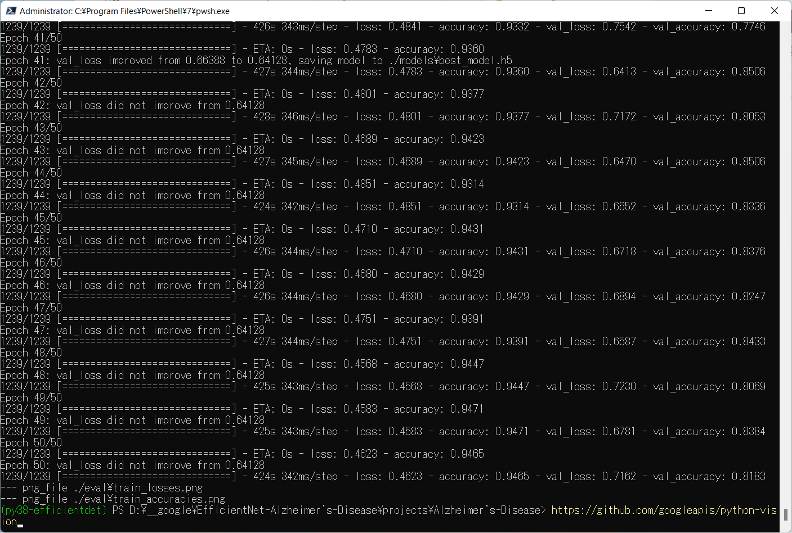
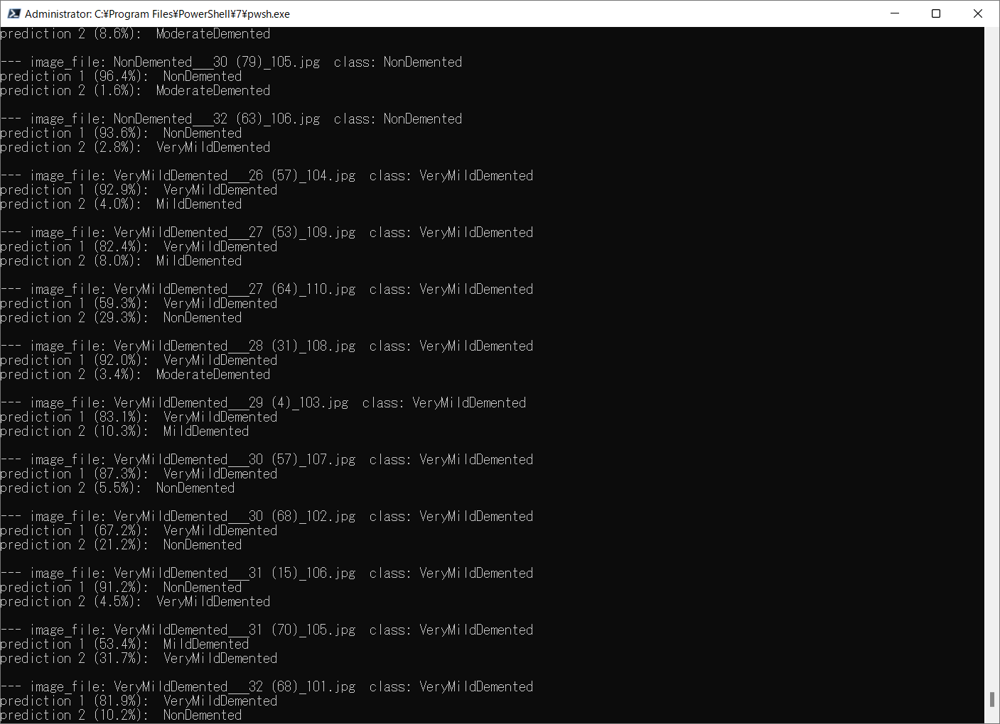

<h2>EfficientNet-Alzheimer's-Disease (Updated: 2022/10/22)</h2>
<a href="#1">1 EfficientNetV2 Alzheimer's Disease Classification </a> 
<a href="#1.1">1.1 Clone repository</a> 
<a href="#1.2">1.2 Prepare Alzheimer's Disease dataset</a> 
<a href="#1.3">1.3 Install Python packages</a> 
<a href="#2">2 Python classes for Alzheimer's Disease Classification</a> 
<a href="#3">3 Pretrained model</a> 
<a href="#4">4 Train</a> 
<a href="#4.1">4.1 Train script</a> 
<a href="#4.2">4.2 Training result</a> 
<a href="#5">5 Inference</a> 
<a href="#5.1">5.1 Inference script</a> 
<a href="#5.2">5.2 Sample test images</a> 
<a href="#5.3">5.3 Inference result</a> 
<a href="#6">6 Evaluation</a> 
<a href="#6.1">6.1 Evaluation script</a> 
<a href="#6.2">6.2 Evaluation result</a> 

<h2>
<a id="1">1 EfficientNetV2 Alzheimer's Disease Classification</a>
</h2>

 This is an experimental EfficientNetV2 Alzheimer's Disease Classification project based on <b>efficientnetv2</b> in <a href="https://github.com/google/automl">Brain AutoML</a>.
 

This image dataset used here has been taken from the following website: 
Alzheimer's Dataset ( 4 class of Images)
https://www.kaggle.com/datasets/tourist55/alzheimers-dataset-4-class-of-images

 

 We use python 3.8 and tensorflow 2.8.0 environment on Windows 11. 
 

<h3>
<a id="1.1">1.1 Clone repository</a>
</h3>
 Please run the following command in your working directory: 
<pre>
git clone https://github.com/atlan-antillia/EfficientNet-Alzheimer's-Disease.git
</pre>
You will have the following directory tree: 
<pre>
.
├─asset
└─projects
    └─Alzheimer's-Disease
        ├─eval
        ├─evaluation
        ├─inference
        ├─models
        ├─Resampled_Alzheimer's_Disease_Images
        └─test
</pre>
<h3>
<a id="1.2">1.2 Prepare Alzheimer's_Disease dataset</a>
</h3>

Please download the dataset <b>Alzheimer's_Disease dataset dataset</b> from the following web site: 
<a href="https://www.kaggle.com/datasets/tourist55/alzheimers-dataset-4-class-of-images">Alzheimer's Dataset ( 4 class of Images)
</a>
 
 
 The distribution of the images of this dataset is very imbalanced as shown below: 

 
 
1. As a working master dataset, we have created <b>Alzheimer's_Disease_Images_512x512_master</b> ]
dataset from the original <b>Alzheimer's_Images</b> above
 by using a python script <a href="./projects/Alzheimer's-Disease/expand.py">expand.py</a>. 
 
2. By applying a resampling tool <a href="https://github.com/martian-antillia/ImageDatasetResampler">ImageDatasetResampler</a>
to <b>Alzheimer's_Disease_Images_512x512_master</b>, we have created a balanced dataset <b>Resampled_Alzheimger's_Disease_Images</b>.  
 
<pre>
Resampled_Alzheimer's_Disease_Images
├─test
│  ├─MildDemented
│  ├─ModerateDemented
│  ├─NonDemented
│  └─VeryMildDemented
└─train
    ├─MildDemented
    ├─ModerateDemented
    ├─NonDemented
    └─VeryMildDemented   
</pre>

</pre>
The number of images in this new dataset is the following: 
 
 

Resampled_Alzheimger's_Images/train/MildDemented: 

 
 
Resampled_Alzheimger's_Images/train/ModerateDemented: 

 
 
Resampled_Alzheimger's_Images/train/NonDemented: 

 
 
Resampled_Alzheimger's_Images/train/VeryMildDemented: 

 

<h3>
<a id="#1.3">1.3 Install Python packages</a>
</h3>
Please run the following commnad to install Python packages for this project. 
<pre>
pip install -r requirements.txt
</pre>
 

<h2>
<a id="2">2 Python classes for Alzheimer's Disease Classification</a>
</h2>
We have defined the following python classes to implement our Alzheimer's Disease Classification. 
<li>
<a href="./ClassificationReportWriter.py">ClassificationReportWriter</a>
</li>
<li>
<a href="./ConfusionMatrix.py">ConfusionMatrix</a>
</li>
<li>
<a href="./CustomDataset.py">CustomDataset</a>
</li>
<li>
<a href="./EpochChangeCallback.py">EpochChangeCallback</a>
</li>
<li>
<a href="./EfficientNetV2Evaluator.py">EfficientNetV2Evaluator</a>
</li>
<li>
<a href="./EfficientNetV2Inferencer.py">EfficientNetV2Inferencer</a>
</li>
<li>
<a href="./EfficientNetV2ModelTrainer.py">EfficientNetV2ModelTrainer</a>
</li>
<li>
<a href="./FineTuningModel.py">FineTuningModel</a>
</li>

<li>
<a href="./TestDataset.py">TestDataset</a>
</li>

<h2>
<a id="3">3 Pretrained model</a>
</h2>
 We have used pretrained <b>efficientnetv2-m</b> model to train Alzheimer's Disease Classification FineTuning Model.
Please download the pretrained checkpoint file from <a href="https://storage.googleapis.com/cloud-tpu-checkpoints/efficientnet/v2/efficientnetv2-m.tgz">efficientnetv2-m.tgz</a>, expand it, and place the model under our top repository.

<pre>
.
├─asset
├─efficientnetv2-m
└─projects
    └─Alzheimer's-Disease
  ...
</pre>

<h2>
<a id="4">4 Train</a>

</h2>
<h3>
<a id="4.1">4.1 Train script</a>
</h3>
Please run the following bat file to train our Alzheimer's Disease Classification efficientnetv2 model by using
<a href="./projects/Alzheimer's-Disease/Resampled_Alzheimer's_Disease_Simpler_Images/train">Resampled_Alzheimger's_Disease_Images/train</a>.
<pre>
./1_train.bat
</pre>
<pre>
rem 1_train.bat
python ../../EfficientNetV2ModelTrainer.py ^
  --model_dir=./models ^
  --eval_dir=./eval ^
  --model_name=efficientnetv2-m  ^
  --data_generator_config=./data_generator.config ^
  --ckpt_dir=../../efficientnetv2-m/model ^
  --optimizer=rmsprop ^
  --image_size=384 ^
  --eval_image_size=480 ^
  --data_dir=./Resampled_Alzheimer's_Images/train ^
  --data_augmentation=True ^
  --valid_data_augmentation=True ^
  --fine_tuning=True ^
  --monitor=val_loss ^
  --learning_rate=0.0001 ^
  --trainable_layers_ratio=0.4 ^
  --dropout_rate=0.2 ^
  --num_epochs=50 ^
  --batch_size=4 ^
  --patience=10 ^
  --debug=True  
</pre>
, where data_generator.config is the following: 
<pre>
; data_generation.config

[training]
validation_split   = 0.2
featurewise_center = Fale
samplewise_center  = False
featurewise_std_normalization=True
samplewise_std_normalization =False
zca_whitening                =False
rotation_range     = 5
horizontal_flip    = False
vertical_flip      = False
width_shift_range  = 0.2
height_shift_range = 0.2
shear_range        = 0.01
zoom_range         = [0.2, 2.0]
data_format        = "channels_last"

[validation]
validation_split   = 0.2
featurewise_center = False
samplewise_center  = False
featurewise_std_normalization=True
samplewise_std_normalization =False
zca_whitening                =False
rotation_range     = 5
horizontal_flip    = False
vertical_flip      = False
width_shift_range  = 0.2
height_shift_range = 0.2
shear_range        = 0.01
zoom_range         = [0.2, 2.0]
data_format        = "channels_last"
</pre>

<h3>
<a id="4.2">4.2 Training result</a>
</h3>

This will generate a <b>best_model.h5</b> in the models folder specified by --model_dir parameter. 
Furthermore, it will generate a <a href="./projects/Alzheimer's-Disease/eval/train_accuracies.csv">train_accuracies</a>
and <a href="./projects/Alzheimer's-Disease/eval/train_losses.csv">train_losses</a> files
 
Training console output: 
 
 
Train_accuracies: 
 

 
Train_losses: 
 

 
<h2>
<a id="5">5 Inference</a>
</h2>
<h3>
<a id="5.1">5.1 Inference script</a>
</h3>
Please run the following bat file to infer the breast cancer in test images by the model generated by the above train command. 
<pre>
./2_inference.bat
</pre>
<pre>
rem 2_inference.bat
python ../../EfficientNetV2Inferencer.py ^
  --model_name=efficientnetv2-m  ^
  --model_dir=./models ^
  --fine_tuning=True ^
  --trainable_layers_ratio=0.4 ^
  --dropout_rate=0.4 ^
  --image_path=./test/*.jpg ^
  --eval_image_size=480 ^
  --label_map=./label_map.txt ^
  --mixed_precision=True ^
  --infer_dir=./inference ^
  --debug=False 
</pre>
 
label_map.txt:
<pre>
Cyst
Normal
Stone
Tumor
</pre>
 
<h3>
<a id="5.2">5.2 Sample test images</a>
</h3>

Sample test images generated by <a href="./projects/Alzheimer's-Disease/create_test_dataset.py">create_test_dataset.py</a> 
from <a href="./projects/Alzheimer's-Disease/Resampled_Alzheimer's_Disease_Simpler_Images/test">Resampled_Alzheimer's_Disease_Simpler_Imagess/test</a>.
 
 

<h3>
<a id="5.3">5.3 Inference result</a>
</h3>
This inference command will generate <a href="./projects/Alzheimer's-Disease/inference/inference.csv">inference result file</a>.
 
 
Inference console output: 
 
 

Inference result (inference.csv): 
 
 
<h2>
<a id="6">6 Evaluation</a>
</h2>
<h3>
<a id="6.1">6.1 Evaluation script</a>
</h3>
Please run the following bat file to evaluate <a href="./projects/Alzheimer's-Disease/Resampled_Alzheimer's_Disease_Images/test">
Resampled_Alzheimer's_Disease_Image/test</a> by the trained model. 
<pre>
./3_evaluate.bat
</pre>
<pre>
rem 3_evaluate.bat
python ../../EfficientNetV2Evaluator.py ^
  --model_name=efficientnetv2-m  ^
  --model_dir=./models ^
  --data_dir=./Resampled_Alzheimer's_Disease_Images/test ^
  --evaluation_dir=./evaluation ^
  --fine_tuning=True ^
  --trainable_layers_ratio=0.4 ^
  --dropout_rate=0.2 ^
  --eval_image_size=480 ^
  --mixed_precision=True ^
  --debug=False 
</pre>
 

<h3>
<a id="6.2">6.2 Evaluation result</a>
</h3>

This evaluation command will generate <a href="./projects/Alzheimer's-Disease/evaluation/classification_report.csv">a classification report</a>
 and <a href="./projects/Alzheimer's-Disease/evaluation/confusion_matrix.png">a confusion_matrix</a>.
 
 
Evaluation console output: 
 
 

 
Classification report: 
 

 
Confusion matrix: 
 

 
<h3>
References
</h3>
<b>1. CAlzheimer's Dataset ( 4 class of Images)</b> 
<pre>
https://www.kaggle.com/datasets/tourist55/alzheimers-dataset-4-class-of-images
</pre>
